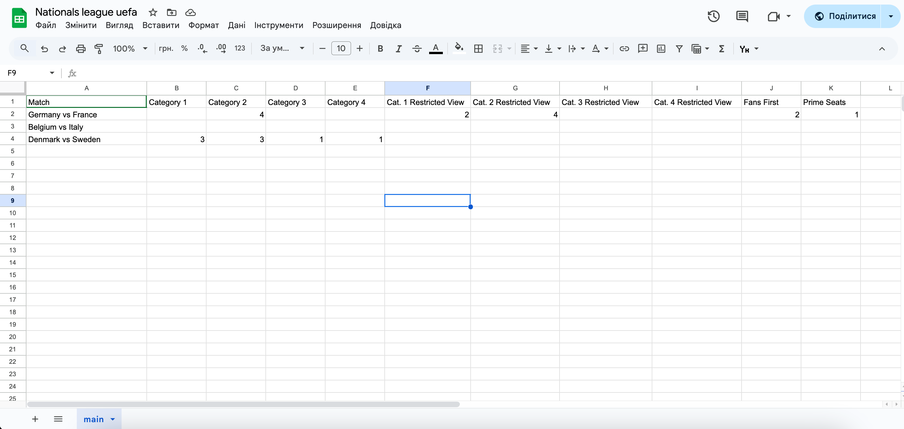
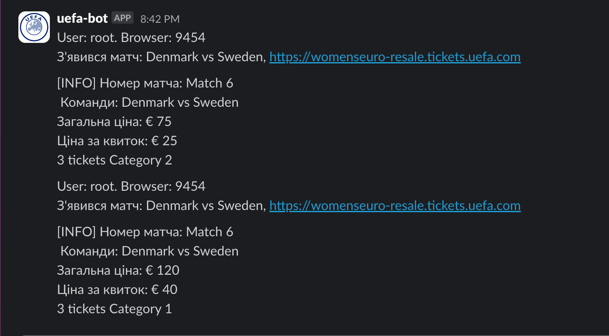

catches tickets on uefa.com, sends notifications to slack about tickets availability.

# How it works
1. it opens up configuration window
2. opens chrome instance after configuration complete
3. changes proxy in BPProxySwitcher extension
4. uses data from Google Sheets to parse info about desired tickets and accounts for uefa
5. checks the matches for tickets availability
6. if tickets are available and its under our filters, response with message to slack and enters that match to try to catch tickets
7. if there are tickets that suits our filters, tries to buy it
8. if ticket is bought, sends message to slack, otherwise returns to initial page


# Requirements
- Google Sheets
- Python 3
- Slack app (optional)
- Proxy (optional)
- Adspower Browser (optional)

# Get Started

1. install requirements ```pip install -r requirements.txt``` or [install.bat](install.bat)
2. setup you Google Sheets following the example in [Spreadsheets Configuration](#spreadsheets-configuration)
4. run bot with ```python -m main.py``` [run.bat](run.bat)

# Spreadsheets Configuration

create google sheets with following attributes:

|Name|Description|Available Values|Required|
|----|-----------|----------------|--------|
|Match|Teams home and oposside divided by vs, from uefa.com page|String: "Germany vs France", "Belgium vs Italy"|Yes|
|Category Name|Any category name that is present on desired match|Int: 5|No|

there should be at least one match on table with at least 1 category and its quantity. Any match that does not contain category or its quantity will be skiped.

## Google Sheets configuration sample


# Slack message sample


